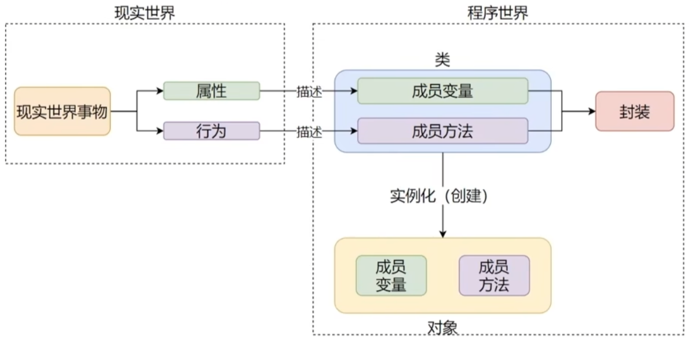

### 面向对象的三大特性
    面向对象编程，是许多编程语言都支持的一种编程思想
    简单理解就是：基于模板(类)去创建实体(对象)，使用对象完成功能开发

#### 面向对象包含3大主要特性：
* 封装
* 继承
* 多态

#### [封装](3_1封装.py)
封装表示的是，将现实世界事物的：
* 属性
* 行为 

封装到类中，描述为：

* 成员变量
* 成员方法

从而完成程序对现实世界事物的描述

#### [继承](3_2继承.py)
单继承
多继承

#### _如果父类有同名方法或属性，先继承的优先级高于后继承_

#### [复写](3_3复写_使用父类成员.py)

