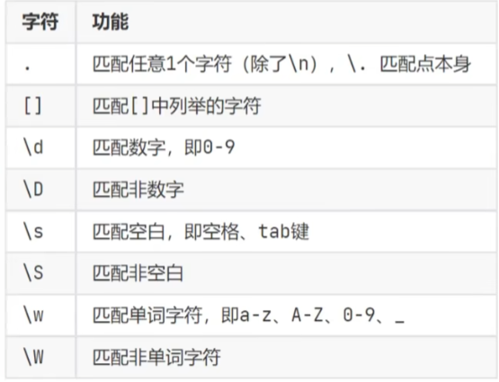
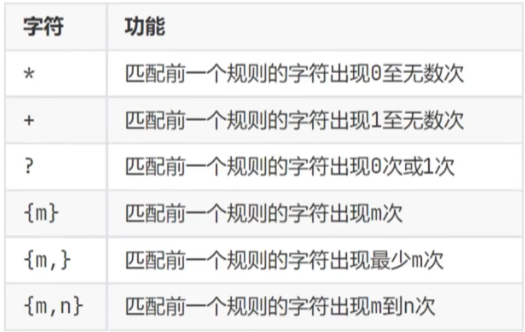
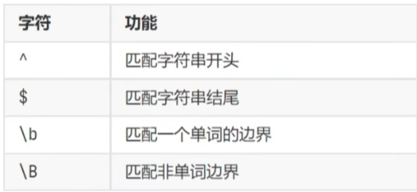
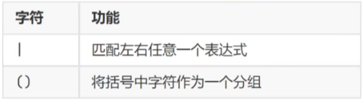

### [闭包](1_闭包.py)
* 在函数嵌套的前提下,内部函数使用了外部函数的变量,并且外部函数返回了内部函数,我们把这个使用外部函数变量的内部函数称之为闭包
#### 定义双层嵌套函数,内层函数可以访问外层函数的变量
#### 将内层函数作为外层函数的返回,此内层函数就是闭包函数
>修改外部变量的值,需要加nonlocal关键字

---

### [装饰器](2_装饰器.py)
* 装饰器其实可是一种闭包,其功能就是在不破坏目标函数原有的代码和功能的前提下,为目标函数增加新功能
* 装饰器就是使用创建一个闭包函数,在闭包函数内调用目标函数
* 可以达到不改动目标函数的同时,增加额外的功能

---

### 设计模式

#### [单列模式](3_设计模式_单列模式.py)
* 单例模式就是一种编程套路
* 使用特定的套路得到特定的效果
* 单例模式就是对一个类,只获取其唯一的示例对象,持续复用它[节省内存]|[节省创建对象的开销]

---

#### [工厂模式](4_设计模式_工厂模式.py)
* 将对象的创建由使用原生类本身创建  转换到有特定的工厂方法来创建

* 好处:
    * 大批量创建对象的时候有统一的入口,易于代码维护
    * 当发生修改时,进修改工厂类的创建方法即可
    * 符合现实世界的模式,即由工厂来制作产品(对象)

---

### 进程 | 线程 | 并行执行

>1.进程: 就是一个程序,运行在系统之上,那么便称之这个程序为一个运行进程,并分配进程ID方便系统管理
>* 进程之间是内存隔离的,即不同的进程拥有各自的内存空间

>2.线程: 线程是归属于进程的,一个进程可以开启多个线程,执行不同的工作,是进程的实际工作最小单位 
>* 线程之间是内存共享的,线程是属于进程的,一个进程内的多个线程之间是共享这个进程所拥有的内存空间的

>操作系统中可以运行多个进程,即多任务运行   
> 一个进程内可以运行多个线程,即多线程运行

>3.并行执行: 并行执行的意思指的是同一时间做不同的工作,进程之间就是并行执行的,操作系统可以同时运行好多程序,这些程序都是在并行执行

>除了进程外,线程其实也可以并行执行
> 也就是比如一个Python程序,其实是完全可以做到:
>* 一个线程在输出: 你好
>* 一个线程在输出: Hello
>##### 像这样一个程序在同一时间做两件乃至多件不同的事情,我们就称之为:多线程并行执行

---

### Socket
>socket(简称 套接字) 是进程之间通信的一个工具,好比现实生活中的插座,所有的家用电器想要工作都是基于插座进行,
进程之间想要进行网络同信需要socket
>* Socket负责进程之间的网络数据传输,好比数据的搬运工

##### [客户端](7_Socket客户端.py)和[服务端](6_Socket服务端.py)
>2个进程之间通过Socket进行相互通信,就必须有服务端和客户端
>* Socket服务端: 等待其他进程的连接,可接受发来的消息,可回复消息
>* Socket客户端: 主动连接服务端,可以发送消息,可以接收消息

---

### 正则表达式
>正则表达式,又称规则表达式(Regular Expression),是使用单个字符串来描述、匹配某个句法规则的字符串,常被用来检索,替换哪些符合某个模式
(规则)的文本
  >* 正则表达式就是使用: 字符串定义规则,并通过规则去验证子字符串是否匹配

---

#### [基础匹配](8_正则表达式_基础匹配.py)

#### match
>re.match(匹配规则, 被匹配字符串)
  >* 匹配开头 找不到返回None

---

#### search
>re.search(匹配规则, 被匹配的字符串)
 >* 搜索整个字符串,找出匹配的,从前向后,找到第一个后,就停止,不会继续向后 找不到返回None

---

#### findall
>findall(匹配规则, 被匹配的字符串)
 >* 匹配整个字符串,找出全部匹配项 找不到返回[]

---

#### [元字符匹配](9_正则表达式_元字符匹配.py)

单字符匹配:

---

数量匹配:

---

边界匹配:

---

分组匹配:

---

#### [递归](10_递归.py)
>递归 
>* 递归在编程中是一种非常重要的算法
>* 递归: 即方法(函数)自己调用自己的一种特殊编程方法 
>* 函数调用自己,即称为递归调用

